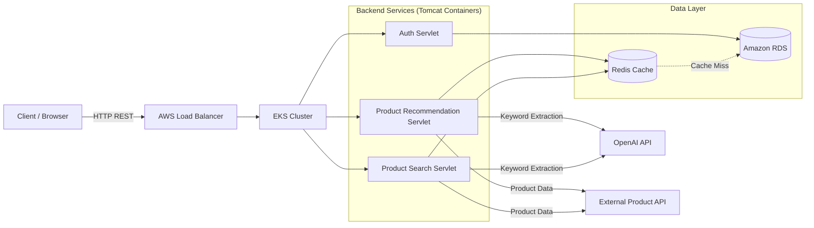

# Personalized-Software-Services-Sales-Recommendation-System-backend

## 📖 Introduction

This project is a high-availability, cloud-native web service designed to provide **personalized product recommendations** for software and services sales. Addressing information overload in e-commerce, the system utilizes **Content-Based Filtering** enhanced by **EdenAI** for keyword extraction and **TF-IDF** for relevance ranking.

The backend is built with **Spring Boot** and **RESTful APIs**, deployed on **Amazon EKS (Kubernetes)** for scalability, and leverages **Redis** with LRU eviction for high-performance caching.

---

## 🏗 System Architecture

The application follows a standard 3-tier architecture optimized for cloud deployment on AWS.

### Architecture Overview

## Core Components

* **Web Server:** Spring Boot REST controllers for Authentication, Product Search, Recommendation, and Favoriting.
* **Database:** Amazon RDS (MySQL) stores user profiles, product metadata, and interaction history.
* **Cache:** Redis acts as a cache-aside layer with LRU eviction to store hot product data and search results.
* **External APIs:**
    * **SerpAPI (Google Shopping):** Fetches real-time, location-aware product listings.
    * **EdenAI (IBM NLP):** Extracts keywords from product descriptions.
    * **Google Geocoding API:** Converts lat/lon to location for localized product search.

## 🛠 Tech Stack

| Domain | Technologies |
| :--- | :--- |
| **Backend** | Java (JDK 8+), Servlets, Apache Tomcat, RESTful APIs |
| **Cloud Infrastructure** | AWS (EKS, EC2, S3, IAM), Amazon RDS (MySQL) |
| **DevOps** | Docker, Kubernetes, Jenkins (CI/CD), Maven |
| **Caching & Performance** | Redis (Cache-aside, LRU, timeout + circuit breaker), Connection Pooling |
| **Algorithms** | Content-Based Recommendation, TF-IDF, NLP (Keyword Extraction) |
| **Frontend** | HTML5, CSS3, JavaScript, AJAX |

## 🚀 Key Features & Implementation

### 1. Intelligent Recommendation Engine
To solve the "cold start" problem inherent in collaborative filtering, this system uses a **Content-Based** approach:
* **Keyword Extraction:** EdenAI parses product descriptions favored by the user, extracting core attributes (e.g., "SaaS", "CRM", "Analytics").
* **Vectorization:** Constructs **TF-IDF** vectors for user profiles and candidate products.
* **Ranking:** Ranks products by TF-IDF keyword scores and searches SerpAPI for similar items.

### 2. High-Performance Caching
* **Strategy:** Implemented a **Redis Cache-Aside** pattern to handle frequent read requests.
* **Resilience:** Redis client timeout (`200ms`), fail-open on errors (fallback to MySQL), and a simple circuit breaker that skips Redis while OPEN.
* **Observability:** `GET /cache/metrics` exposes hit/miss/error counters and hit rate; `GET /health/redis` returns 503 when the circuit is OPEN. Circuit trips also emit `ALERT redis_availability=DOWN` log lines for log-based paging.
* **Optimization:** Added query deduplication logic to prevent redundant external API calls to Google Jobs.
* **Result:** Reduced average API response latency by **~30%**.

### 3. Cloud-Native Reliability
* **Scalability:** Deployed on **AWS EKS** with Horizontal Pod Autoscaling (HPA) to handle traffic surges.
* **CI/CD:** Automated build and deployment pipeline using **Jenkins** and **Docker**, enabling rolling updates with health checks to ensure zero downtime.
* **Data Integrity:** Designed MySQL schemas with proper indexing on `user_id` and `interaction_timestamp` for fast retrieval of history.

## 📊 Project Impact

* **Latency Reduction:** Database tuning and Redis caching cut response times by **30%**.
* **User Engagement:** The personalized ranking algorithm and real-time analytics features increased job application submissions by **~20%**.
* **Reliability:** Achieved high availability through Kubernetes orchestration and stateless servlet design.

## 🔧 Getting Started

### Prerequisites
* Java 8+
* Maven 3.6+
* Docker & Kubernetes CLI (kubectl)
* MySQL 5.7+
* Redis

## 📝 License

This project is licensed under the MIT License - see the [LICENSE](LICENSE) file for details.
